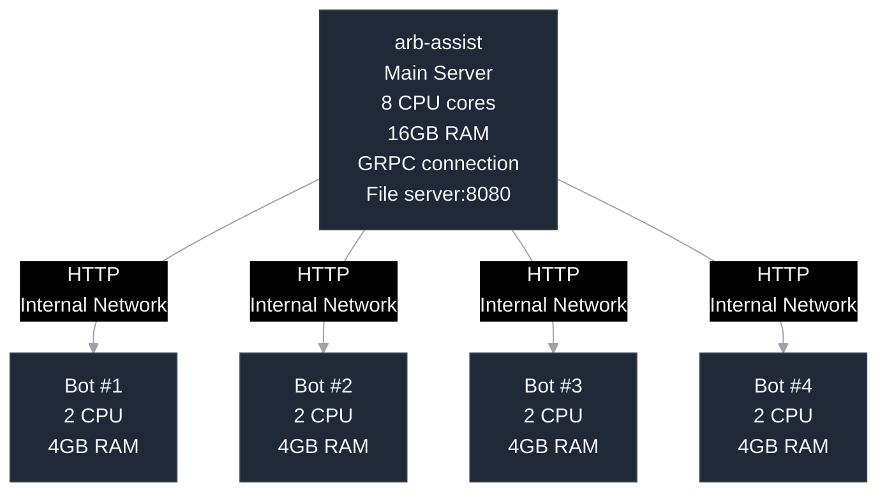

# File Server Mode

The file server mode allows arb-assist to serve configuration files over HTTP, enabling centralized management of multiple bot instances.

## Overview

When enabled, arb-assist creates a lightweight HTTP server that serves generated configuration files. This allows you to:
- Run arb-assist on one powerful server
- Deploy bots on multiple lightweight VPS instances
- Centralize configuration management
- Reduce resource usage on bot servers

## Configuration

### Enabling File Server

Set the port in your `config.toml`:

```toml
port = 8080  # Enable on port 8080
# or
port = 0     # Disable file server (default)
```

### Available Endpoints

Once enabled, the following files are served:

| Endpoint | Description | Mode Required |
|----------|-------------|---------------|
| `http://server:8080/smb-config.toml` | SMB configuration | `smb` or `both` |
| `http://server:8080/notarb-config.json` | NotArb configuration | `na` or `both` |
| `http://server:8080/markets.json` | NotArb markets | `na` or `both` |
| `http://server:8080/lookup-tables.json` | NotArb ALUTs | `na` or `both` |
| `http://server:8080/notarb-attributes.json` | NotArb attributes | `na` or `both` |

## Security Configuration

### Firewall Rules


**Warning**: The file server has no built-in authentication. Use firewall rules to restrict access.


#### UFW (Ubuntu Firewall)

Allow specific IPs only:
```bash
# Allow from specific bot server
sudo ufw allow from 192.168.1.100 to any port 8080

# Allow from subnet
sudo ufw allow from 192.168.1.0/24 to any port 8080

# Deny all others
sudo ufw deny 8080
```

#### iptables

More granular control:
```bash
# Allow specific IPs
sudo iptables -A INPUT -p tcp --dport 8080 -s 192.168.1.100 -j ACCEPT
sudo iptables -A INPUT -p tcp --dport 8080 -s 192.168.1.101 -j ACCEPT

# Drop all others
sudo iptables -A INPUT -p tcp --dport 8080 -j DROP

# Save rules
sudo iptables-save > /etc/iptables/rules.v4
```

### Cloud Provider Security Groups

#### AWS Security Group
```bash
# Create security group
aws ec2 create-security-group --group-name arb-assist-server --description "arb-assist file server"

# Add rules for bot servers
aws ec2 authorize-security-group-ingress \
    --group-name arb-assist-server \
    --protocol tcp \
    --port 8080 \
    --source-group bot-servers-sg
```

#### Google Cloud Firewall
```bash
gcloud compute firewall-rules create arb-assist-server \
    --allow tcp:8080 \
    --source-ranges 192.168.1.0/24 \
    --target-tags arb-assist
```

### Reverse Proxy with Authentication

For additional security, use nginx with basic auth:

1. **Install nginx**:
```bash
sudo apt install nginx apache2-utils
```

2. **Create password file**:
```bash
sudo htpasswd -c /etc/nginx/.htpasswd botuser
```

3. **Configure nginx**:
```nginx
server {
    listen 443 ssl;
    server_name arb-assist.yourdomain.com;
    
    ssl_certificate /path/to/cert.pem;
    ssl_certificate_key /path/to/key.pem;
    
    location / {
        auth_basic "arb-assist Config Server";
        auth_basic_user_file /etc/nginx/.htpasswd;
        
        proxy_pass http://localhost:8080;
        proxy_set_header Host $host;
        proxy_set_header X-Real-IP $remote_addr;
    }
}
```

4. **Restart nginx**:
```bash
sudo systemctl restart nginx
```

## Bot Configuration

### SMB-Onchain Setup

1. **Create config fetcher script** on bot server:
```bash
#!/bin/bash
# fetch-config.sh
CONFIG_SERVER="http://192.168.1.50:8080"
LOCAL_CONFIG="smb-config.toml"

# Fetch new config
wget -q -O ${LOCAL_CONFIG}.new ${CONFIG_SERVER}/smb-config.toml

# Check if download successful
if [ $? -eq 0 ]; then
    # Check if config changed
    if ! cmp -s ${LOCAL_CONFIG} ${LOCAL_CONFIG}.new; then
        mv ${LOCAL_CONFIG}.new ${LOCAL_CONFIG}
        echo "Config updated at $(date)"
    else
        rm ${LOCAL_CONFIG}.new
    fi
else
    echo "Failed to fetch config at $(date)"
fi
```

2. **Add to crontab**:
```bash
# Update every minute
* * * * * /home/bot/fetch-config.sh >> /home/bot/config-updates.log 2>&1
```

3. **Configure PM2 to watch**:
```bash
pm2 start smb-onchain --watch smb-config.toml -- run smb-config.toml
```

### NotArb Setup

1. **Create multi-file fetcher**:
```bash
#!/bin/bash
# fetch-notarb-configs.sh
CONFIG_SERVER="http://192.168.1.50:8080"

# Files to fetch
FILES=(
    "notarb-config.json"
    "markets.json"
    "lookup-tables.json"
    "notarb-attributes.json"
)

for FILE in "${FILES[@]}"; do
    wget -q -O ${FILE}.new ${CONFIG_SERVER}/${FILE}
    if [ $? -eq 0 ]; then
        if ! cmp -s ${FILE} ${FILE}.new; then
            mv ${FILE}.new ${FILE}
            echo "${FILE} updated at $(date)"
        else
            rm ${FILE}.new
        fi
    fi
done
```

2. **Setup auto-fetch**:
```bash
# Every 30 seconds for NotArb
* * * * * /home/bot/fetch-notarb-configs.sh
* * * * * sleep 30 && /home/bot/fetch-notarb-configs.sh
```

## Multi-Server Architecture

### Recommended Setup



### Benefits

1. **Resource Efficiency**:
   - One powerful server for analysis
   - Multiple cheap VPS for execution
   - Reduced overall costs

2. **Scalability**:
   - Easy to add/remove bot instances
   - No need to run GRPC on each bot
   - Centralized updates

3. **Reliability**:
   - Bot servers can be in different regions
   - Main server failure doesn't stop existing bots
   - Easy disaster recovery

## Monitoring

### Server Monitoring

Monitor file server health:

```bash
#!/bin/bash
# monitor-file-server.sh

# Check if port is listening
if netstat -tuln | grep -q ":8080 "; then
    echo "File server is running"
    
    # Test file availability
    curl -s -o /dev/null -w "%{http_code}" http://localhost:8080/smb-config.toml
else
    echo "File server is NOT running"
    # Alert/restart logic here
fi
```

### Access Logging

Track which bots are fetching configs:

```bash
# Enable verbose logging in arb-assist
log_output = true

# Or use nginx access logs
tail -f /var/log/nginx/access.log | grep arb-assist
```

### Bandwidth Monitoring

Track file server bandwidth:
```bash
# Install vnstat
sudo apt install vnstat

# Monitor interface
vnstat -l -i eth0
```

## Performance Optimization

### Caching Headers

If using nginx, add caching headers:
```nginx
location / {
    add_header Cache-Control "public, max-age=30";
    add_header X-Content-Type-Options nosniff;
    
    proxy_pass http://localhost:8080;
}
```

### Compression

Enable gzip compression:
```nginx
gzip on;
gzip_types text/plain application/json;
gzip_comp_level 6;
```

### Rate Limiting

Prevent abuse with rate limiting:
```nginx
limit_req_zone $binary_remote_addr zone=arb_assist:10m rate=10r/s;

location / {
    limit_req zone=arb_assist burst=20 nodelay;
    # ... rest of config
}
```

## Troubleshooting

### File Server Not Accessible

1. **Check if running**:
```bash
netstat -tuln | grep 8080
```

2. **Test locally**:
```bash
curl http://localhost:8080/smb-config.toml
```

3. **Check firewall**:
```bash
sudo ufw status
sudo iptables -L -n
```

### Bots Not Updating

1. **Verify fetch script**:
```bash
# Run manually
bash fetch-config.sh

# Check logs
tail -f config-updates.log
```

2. **Check permissions**:
```bash
ls -la smb-config.toml*
```

3. **Verify PM2 watching**:
```bash
pm2 info smb-onchain | grep watching
```

### High Bandwidth Usage

If bandwidth is excessive:
1. Reduce fetch frequency
2. Implement conditional fetching (If-Modified-Since)
3. Use compression
4. Consider push model instead of pull

## Best Practices

1. **Security First**:
   - Always use firewall rules
   - Consider VPN for bot network
   - Monitor access logs
   - Use HTTPS with authentication

2. **Reliability**:
   - Implement health checks
   - Use multiple config servers
   - Cache last known good config
   - Alert on failures

3. **Performance**:
   - Monitor bandwidth usage
   - Optimize fetch frequency
   - Use compression
   - Consider CDN for global bots

4. **Maintenance**:
   - Document server IPs
   - Keep firewall rules updated
   - Monitor disk space
   - Regular security audits