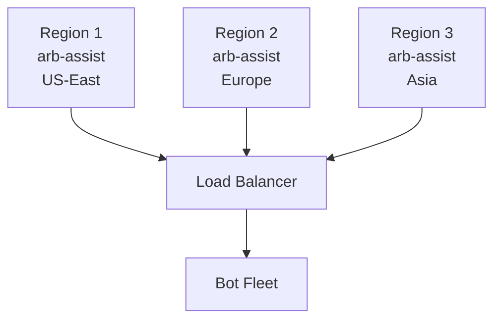

# Performance Optimization

This guide covers advanced techniques for maximizing arb-assist performance and efficiency.

## System Architecture Optimization

### CPU Optimization

#### Core Assignment

Dedicate CPU cores for optimal performance:

```bash
# Find arb-assist process ID
PID=$(pgrep arb-assist)

# Assign to specific cores (e.g., cores 4-7)
sudo taskset -cp 4-7 $PID

# Verify assignment
taskset -cp $PID
```

#### Process Priority

Increase process priority:

```bash
# Set high priority (nice value -20 is highest)
sudo renice -n -15 -p $(pgrep arb-assist)

# Or start with high priority
nice -n -15 ./arb-assist
```

#### CPU Governor

Set CPU to performance mode:

```bash
# Check current governor
cat /sys/devices/system/cpu/cpu*/cpufreq/scaling_governor

# Set to performance mode
echo performance | sudo tee /sys/devices/system/cpu/cpu*/cpufreq/scaling_governor
```

### Memory Optimization

#### Huge Pages

Enable transparent huge pages:

```bash
# Enable THP
echo always | sudo tee /sys/kernel/mm/transparent_hugepage/enabled
echo always | sudo tee /sys/kernel/mm/transparent_hugepage/defrag

# Verify
cat /sys/kernel/mm/transparent_hugepage/enabled
```

#### Memory Allocation

Pre-allocate memory to avoid fragmentation:

```bash
# Add to system startup
echo 1 > /proc/sys/vm/overcommit_memory
echo 2 > /proc/sys/vm/overcommit_ratio
```

#### Swap Configuration

Minimize swap usage:

```bash
# Reduce swappiness
echo 10 | sudo tee /proc/sys/vm/swappiness

# Or disable swap entirely (if enough RAM)
sudo swapoff -a
```

### Network Optimization

#### TCP Tuning

Optimize TCP stack for low latency:

```bash
# /etc/sysctl.conf additions
net.core.rmem_max = 134217728
net.core.wmem_max = 134217728
net.ipv4.tcp_rmem = 4096 87380 134217728
net.ipv4.tcp_wmem = 4096 65536 134217728
net.core.netdev_max_backlog = 30000
net.ipv4.tcp_congestion_control = bbr
net.ipv4.tcp_notsent_lowat = 16384

# Apply changes
sudo sysctl -p
```

#### Network Interface Tuning

Optimize NIC settings:

```bash
# Increase ring buffer
sudo ethtool -G eth0 rx 4096 tx 4096

# Enable offloading
sudo ethtool -K eth0 gso on gro on tso on

# Set interrupt coalescing
sudo ethtool -C eth0 adaptive-rx on adaptive-tx on
```

### Disk I/O Optimization

#### File System Selection

Choose appropriate file system:
- **ext4**: General purpose, reliable
- **XFS**: Better for large files
- **tmpfs**: For temporary data (RAM-based)

#### Mount Options

Optimize mount options:

```bash
# /etc/fstab for SSD
/dev/nvme0n1p1 / ext4 defaults,noatime,nodiratime,discard 0 1

# For config directory (if separate)
tmpfs /var/arb-assist tmpfs defaults,size=1G 0 0
```

#### I/O Scheduler

Set appropriate scheduler:

```bash
# For NVMe/SSD
echo none | sudo tee /sys/block/nvme0n1/queue/scheduler

# For HDD
echo deadline | sudo tee /sys/block/sda/queue/scheduler
```

## Configuration Optimization

### Processing Frequency

Balance between freshness and CPU usage:

```toml
# Aggressive (high CPU, fresh data)
update_interval = 5000   # 5 seconds
halflife = 30000        # 30 seconds

# Balanced
update_interval = 10000  # 10 seconds
halflife = 120000       # 2 minutes

# Conservative (low CPU, delayed data)
update_interval = 30000  # 30 seconds
halflife = 300000       # 5 minutes
```

### Data Scope Optimization

Reduce processing overhead:

```toml
# Limit tracked entities
mints_to_rank = 20        # Instead of 100
aluts_per_pool = 10       # Instead of 50

# Filter aggressively
filter_programs = true    # Only specific programs
dexes = [                 # Only major DEXes
  "675kPX9MHTjS2zt1qfr1NYHuzeLXfQM9H24wFSUt1Mp8",
  "whirLbMiicVdio4qvUfM5KAg6Ct8VwpYzGff3uctyCc",
]
```

### Memory Usage Patterns

Configure for your available memory:

#### Memory Configuration Examples

##### Conservative Configuration
```toml
mints_to_rank = 10
halflife = 60000  # Aggressive decay
update_interval = 20000
aluts_per_pool = 5
```

##### Balanced Configuration
```toml
mints_to_rank = 30
halflife = 120000
update_interval = 10000
aluts_per_pool = 20
```

##### Aggressive Configuration
```toml
mints_to_rank = 100
halflife = 300000
update_interval = 5000
aluts_per_pool = 50
```

## Parallel Processing

### Multi-Instance Setup

Run multiple specialized instances:

#### Instance 1: High-Value Focus
```toml
# config-highvalue.toml
filter_thresholds = [{
  min_profit = 100_000_000,
  min_roi = 5.0,
}]
output = "highvalue-config"
port = 8081
```

#### Instance 2: Volume Focus
```toml
# config-volume.toml
filter_thresholds = [{
  min_total_volume = 10_000_000_000,
  min_turnover = 3.0,
}]
output = "volume-config"
port = 8082
```

Start both:
```bash
pm2 start arb-assist --name arb-highvalue -- -c config-highvalue.toml
pm2 start arb-assist --name arb-volume -- -c config-volume.toml
```

### Load Distribution

Distribute different tasks:

1. **Main Instance**: Full analysis
2. **Secondary**: Specific token monitoring
3. **Tertiary**: New pool detection

## Monitoring & Profiling

### Performance Metrics

Create monitoring dashboard:

```bash
#!/bin/bash
# monitor-performance.sh

while true; do
    clear
    echo "=== ARB-ASSIST PERFORMANCE MONITOR ==="
    echo "Time: $(date)"
    echo ""
    
    # CPU Usage
    echo "CPU Usage:"
    ps -p $(pgrep arb-assist) -o %cpu,vsz,rss,comm
    echo ""
    
    # Memory Usage
    echo "Memory Usage:"
    free -h
    echo ""
    
    # Network Connections
    echo "Active Connections:"
    netstat -an | grep ESTABLISHED | grep -E "443|8080" | wc -l
    echo ""
    
    # Disk I/O
    echo "Disk I/O:"
    iostat -x 1 2 | grep -A1 avg-cpu | tail -2
    
    sleep 5
done
```

### Profiling Tools

Use system profiling tools:

```bash
# CPU profiling with perf
sudo perf record -p $(pgrep arb-assist) -g -- sleep 30
sudo perf report

# Memory profiling
sudo pmap -x $(pgrep arb-assist)

# Network profiling
sudo tcpdump -i any -c 1000 -w arb-assist.pcap host your.rpc.endpoint
```

## Optimization Strategies

### Startup Optimization

Reduce startup time:

1. **Pre-warm Caches**
```bash
# Pre-fetch common data
curl -s https://your.rpc/health > /dev/null
```

2. **Parallel Initialization**
   - Start GRPC connection
   - Load configuration
   - Initialize data structures
   (All in parallel)

### Runtime Optimization

Continuous optimization:

1. **Adaptive Intervals**
```toml
# Adjust based on activity
# High activity: Faster updates
# Low activity: Slower updates
```

2. **Smart Caching**
   - Cache RPC responses
   - Reuse ALUT data
   - Store computed metrics

3. **Lazy Evaluation**
   - Compute only when needed
   - Defer expensive calculations
   - Use incremental updates

### Memory Management

Prevent memory bloat:

1. **Regular Cleanup**
```bash
# Restart periodically
0 */6 * * * systemctl restart arb-assist
```

2. **Bounded Collections**
   - Limit historical data
   - Cap queue sizes
   - Prune old entries

## Scaling Strategies

### Vertical Scaling

Upgrade single instance:

| Component | Basic | Recommended | Optimal |
|-----------|-------|-------------|---------|
| CPU | 8-core dedicated Ryzen | 16-core dedicated Ryzen | 32+ core dedicated Ryzen |
| RAM | 16 GB | 32 GB | 64+ GB |
| Network | Default/Basic | Default/Basic | Default/Basic |
| Storage | 1 GB | 1 GB | 1 GB |

### Horizontal Scaling

Distribute across multiple servers:



### Edge Computing

Deploy close to data sources:
- Colocate with RPC nodes
- Use regional GRPC endpoints
- Minimize network hops

## Troubleshooting Performance

### High CPU Usage

Diagnose with:
```bash
# Check what's consuming CPU
htop -p $(pgrep arb-assist)

# Trace system calls
sudo strace -c -p $(pgrep arb-assist)
```

Solutions:
- Increase update_interval
- Reduce mints_to_rank
- Enable filter_programs

### Memory Leaks

Detect with:
```bash
# Monitor memory growth
watch -n 10 'ps aux | grep arb-assist | grep -v grep'

# Check for leaks
valgrind --leak-check=full ./arb-assist
```

Solutions:
- Reduce halflife
- Restart periodically
- Update to latest version

### Network Bottlenecks

Identify with:
```bash
# Monitor bandwidth
iftop -i eth0

# Check latency
mtr your.grpc.endpoint
```

Solutions:
- Use compression
- Filter at source
- Add caching layer

## Best Practices

1. **Baseline First**: Measure before optimizing
2. **One Change at a Time**: Isolate impact
3. **Monitor Continuously**: Track all metrics
4. **Document Changes**: Keep optimization log
5. **Test Thoroughly**: Verify improvements
6. **Plan for Growth**: Design for scale
7. **Regular Reviews**: Reassess quarterly

## Performance Checklist

Before deployment:
- [ ] CPU governor set to performance
- [ ] Network stack optimized
- [ ] File system tuned
- [ ] Memory limits configured
- [ ] Monitoring in place
- [ ] Profiling baseline recorded
- [ ] Scaling plan documented
- [ ] Rollback procedure ready

Remember: Premature optimization is the root of all evil. Profile first, optimize what matters, and always measure the impact.